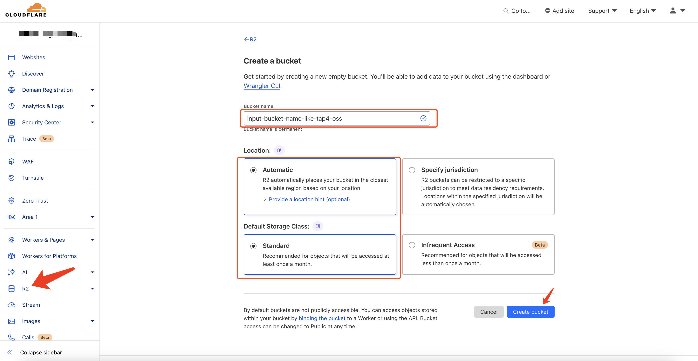
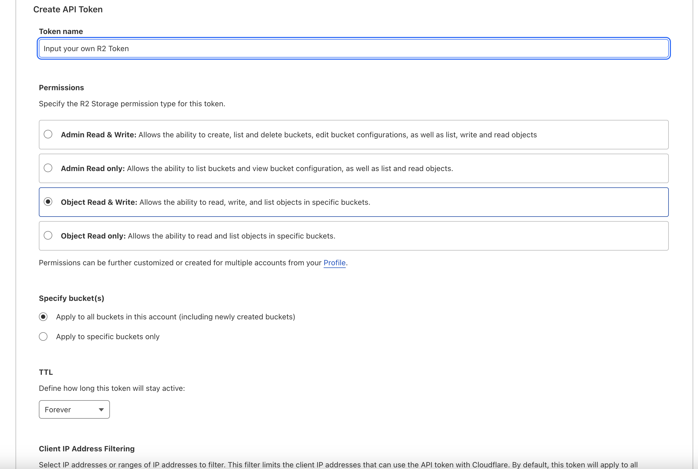
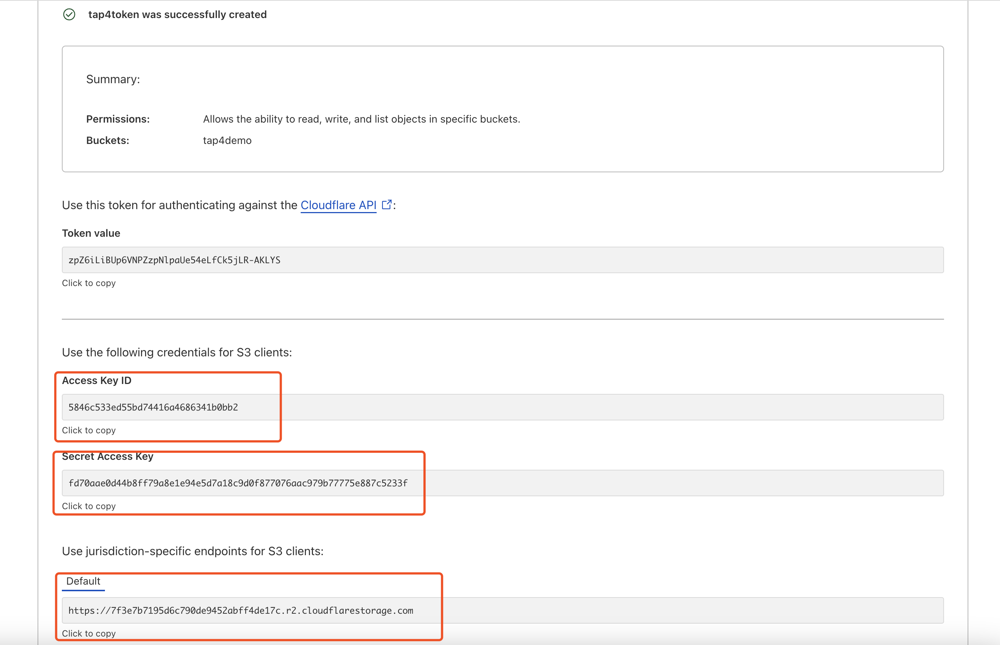

# Tap4 AI Crawler

Tap4 AI Crawler is an open source web crawler built by [tap4.ai](https://tap4.ai), that will convert the website into the website summarize info with LLM. Includes powerful scraping, crawling and data extraction capabilities, web page screenshots. With Tap4 AI Crawler, you can not only easily update the ai tool detail for your AI Tools Directory but also summary of the website.

This project is based on Python, very lightweight, easy to maintain, suitable for individual developers interested in AI tools directories, and also for learners interested in Python. We welcome everyone to fork and star.

English | [简体中文](./README.zh-CN.md)

## Follow Us

Follow us on Twitter: https://x.com/tap4ai

If you find this project helpful, you can buy me a coffee:

<a href="https://www.buymeacoffee.com/tap4ai0o" target="_blank"></a>

## Features

- Fetching titles, descriptions, and introductions of input websites
- Making screenshots of the input websites
- Support for using LLM (llama3/chatgpt) to process website introductions and generate SEO Friendly Markdown descriptions
- Quick configuration
- Fast deployment


## Quick Start

- [Register on Cloudflare](https://www.cloudflare.com?utm_source=tap4ai&utm_campaign=oss)
- Select R2 Service and create a bucket for image store, set for public access(option: set custom domain) and edit CORS Policy.
  
- CORS Policy as below:

```sh
[
  {
    "AllowedOrigins": [
      "*"
    ],
    "AllowedMethods": [
      "GET",
      "POST",
      "PUT",
      "DELETE",
      "HEAD"
    ],
    "AllowedHeaders": [
      "*"
    ]
  }
]
```

- Create R2 API Tokens for R2 API and select permission with Object Read & Write. Save your own params: ENDPOINT_URL, BUCKET_NAME, ACCESS_KEY_ID, SECRET_ACCESS_KEY, CUSTOM_DOMAIN. The params will config in the .env for tap4-ai-crawler.
  
  
-

- [](https://zeabur.com?referralCode=leoli202303&utm_source=leoli202303&utm_campaign=oss)
- Create a new project and service on Zeabur
- Fork [tap4-ai-crawler](https://github.com/6677-ai/tap4-ai-crawler) to your own github and update .env params with your own.

### （2）Deploying in Zeabur based on code mode

Deploying the fork github repository in Zeabur, and configuring environment variables in Zeabur or manually modifying the .env file in the code repository. The environment variables are as follows:

- `GROQ_API_KEY`: Key for Groq, apply for it [Here](https://console.groq.com/keys)
- `S3_ENDPOINT_URL`: Endpoint for S3(Recommand Cloudflare R2), apply for [R2](https://www.cloudflare.com/zh-cn/developer-platform/r2/)
- `S3_BUCKET_NAME`: Bucket name for S3(such as Cloudflare R2)
- `S3_ACCESS_KEY_ID`: Access key ID for S3(such as Cloudflare R2)
- `S3_SECRET_ACCESS_KEY`: Secret access key for S3(such as Cloudflare R2)
- `S3_CUSTOM_DOMAIN`: Custom domain for S3(such as Cloudflare R2), if you have a custom domain, fill it in; otherwise, it can be left blank.

## Runs on local

### Install

- Python 3.x version

### Setup

#### (1) Clone this project

```sh
git clone https://github.com/6677-ai/tap4-ai-crawler.git
```

#### (2) Apply for llama3 key on Groq

[Groq key apply](https://console.groq.com/keys)

#### (3) Apply for S3 object storage information

- Endpoint
- Access Key Id
- Secret Access Key
- Bucket Name

#### (4) Set environment variables

- Modify the `.env` file in the root directory with the following content, example:

```sh
## LLM Configuration: Large model related configuration
GROQ_API_KEY=gsk_********

## Object Storage Configuration: Storage related configuration
R2_ENDPOINT_URL=https://*****.r2.cloudflarestorage.com
R2_BUCKET_NAME=tap4ai
R2_ACCESS_KEY_ID=****
R2_SECRET_ACCESS_KEY=****
R2_CUSTOM_DOMAIN=****
```

#### (5) Run locally

Install Python dependencies

```sh
pip install -r requirements.txt
```

Run

```sh
python main_api.py
```

After running, a RestAPI will be exposed, access URL suffix: /site/crawl

## How to request the API

Use curl to verify the API with POST request.
Request params:

- Format: Json format,
- params: url (such as: https://tap4.ai)
  Request as below:

```sh
curl -X POST -H "Content-Type: application/json" -d '{"url": "https://tap4.ai"}' http://127.0.0.1:8040/site/crawl
```

Response Params:

- Format: Json format
- Params: data-description: Description of website
- Params: data-detail: Detail content of website
- Params: data-screenshot_data: Screenshot of website
- Params: data-screenshot_thumbnail_data: Screenshot thumbnail of website
- Params: data-title: Title of website

```sh
{
    "code": 200,
    "data": {
        "description": "Tap4 AI Directory is a tool provides free AI Tools Directory. Get your favorite AI tools with Tap4 AI Directory, Tap4 AI Directory aims to collect all the AI tools and provide the best for users.",
        "detail": "### What is Tap4 AI?\n\nTap4 AI is an AI-driven platform that provides access to a vast array of AI technologies for various needs, including ChatGPT, GPT-4o for text generation and image understanding, Dalle3 for image creation, and document analysis.\n\n### How to Use Tap4 AI\n\nEvery user can utilize GPT-4o for free up to 20 times a day on tap4.ai. Subscribing to the platform grants additional benefits and extended access beyond the free usage limits.\n\n### Features of Tap4 AI\n\n#### Can I Generate Images Using Tap4 AI?\n\nYes, with Dalle3's text-to-image generation capability, users can create images, sharing credits with GPT-4o for a seamless creative experience.\n\n#### How Many GPTs are Available on Tap4 AI?\n\nTap4.ai offers nearly 200,000 GPT models for a wide variety of applications in work, study, and everyday life. You can freely use these GPTs without the need for a ChatGPT Plus subscription.\n\n#### How Can I Maximize My Use of Tap4 AI's AI Services?\n\nBy leveraging the daily free uses of GPT-4o document reading, and Dalle's image generation, users can explore a vast range of AI-powered tools to support various tasks.\n\n#### Will My Information Be Used for Your Training Data?\n\nWe highly value user privacy, and your data will not be used for any training purposes. If needed, you can delete your account at any time, and all your data will be removed as well.\n\n#### When Would I Need a Tap4 AI Subscription?\n\nIf the 20 free GPT-4o conversations per day do not meet your needs and you heavily rely on GPT-4o, we invite you to subscribe to our affordable products.",
        "languages": [],
        "screenshot_data": "https://demo.tap4.cn/tools/2024/6/15/tap4-ai-1718447471.png",
        "screenshot_thumbnail_data": "https://demo.tap4.cn/tools/2024/6/15/tap4-ai-thumbnail-1718447477.png",
        "tags": null,
        "title": "Get your best AI Tools | Tap4 AI Directory",
        "url": "https://tap4.ai"
    },
    "msg": "success"
}
```

## Join our group in wechat

If you are interested in this project, feel free to scan the QR code to join our WeChat group: 

## Links to our products

### TAP4-AI-Directory

The Collection for the AI tools all over the world. | Collect free ChatGPT mirrors, alternatives, prompts, other AI tools, etc. For more, please visit: [Tap4 AI](https://tap4.ai/)

### How to get your first users for startup at the website list

Here is the website list for submitting your product to get users. Please visit [StartUp Your Product List](https://github.com/6677-ai/TAP4-AI-Directory/blob/main/Startup-Your-Product-List.md)

### Free Stable Diffusion 3 Online Tool

[Free Stable Diffusion 3 Online](https://stable-diffusion-3.online)

### Free Tiny Png Tool

[Free Type Png Tool](https://freetinypng.com)

### Free GPT2 Output Detector

[Free GPT2 Output Detector](https://openai-openai-detector.com/)

### The Tattoo AI Generator and Design

Tattoo AI Design is a tattoo AI generator and design tool for tattoo fans. If you are interested, visit [Tattoo AI Design](https://tattooai.design/)

## Sponsor List

### AI Anime Girlfriend -- AI Anime Girl Chat & Generator

Anime Girl Studio is the AI anime girl generator and chat product. You can generate what you like and chat with the AI anime girl, please visit [AI Anime Girlfriend](https://animegirl.studio/)

### Best AI GirlFriend -- Best AI Girlfriend & Generator

Best AI Girl Friend is the AI girl generator and chat product. You can generate what you like and chat with the AI anime girl, please visit [Best AI Girlfriend](https://aigirl.best/)
